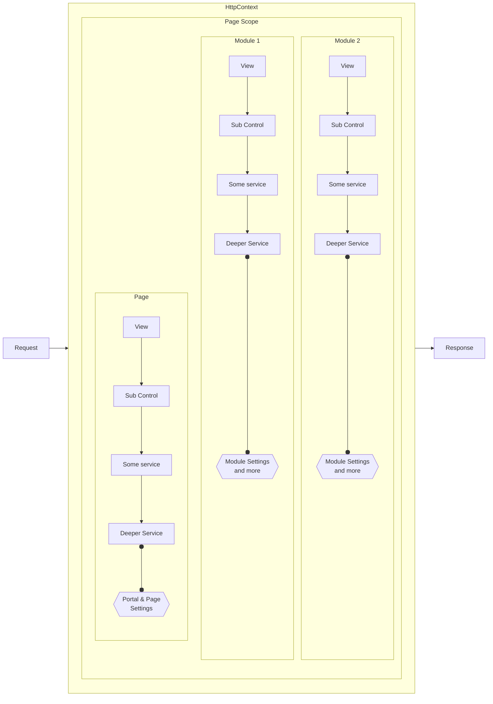

# Scopes Diagram

```mermaid
flowchart LR
 subgraph PageScope["Page Scope"]
    direction TB
        Page["Page"]
        Module1["Module1"]
        Module2["Module2"]
  end
 subgraph TOP["HttpContext"]
    direction TB
        PageScope
  end
 subgraph Module1["Module 1"]
    direction TB
        m1["View"]
        m2["Sub Control"]
        m3["Some service"]
        m4["Deeper Service"]
        M1ModuleSettings["Module Settings
        and more"]
  end
 subgraph Module2["Module 2"]
    direction TB
        m21["View"]
        m22["Sub Control"]
        m23["Some service"]
        m24["Deeper Service"]
        M2ModuleSettings["Module Settings
        and more"]
  end
 subgraph Page["Page"]
        n1["View"]
        n2["Sub Control"]
        n3["Some service"]
        n4["Deeper Service"]
        PagePortalSettings["Portal & Page
        Settings"]
  end
    A["Request"] --> TOP
    TOP --> B["Response"]
    m1 --> m2
    m2 --> m3
    m3 --> m4
    m21 --> m22
    m22 --> m23
    m23 --> m24
    n1 --> n2
    n2 --> n3
    n3 --> n4
    n4 o--o PagePortalSettings
    m4 o--o M1ModuleSettings
    m24 o--o M2ModuleSettings

    M1ModuleSettings@{ shape: hex}
    M2ModuleSettings@{ shape: hex}
    PagePortalSettings@{ shape: hex}

```